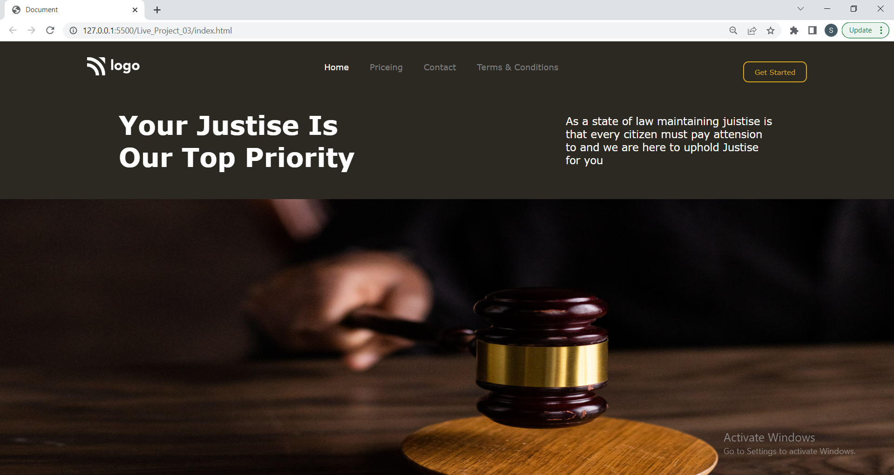

# Your-Justise-is-our-top-priority []

This is basically a one pager webpage for an imaginary company that provides juistise to thier customers. The project made in HTML/CSS.
Hope you like my project !! And as it is not responsive it works well in laptop screen and please zoom in in case of other device.


## 🛠 Technologies Used
  - HTML - Hyper Text Markup Language
  - CSS - Cascadeing Style Sheet
  

## Demo



## Run Locally

Clone the project

```bash
  git clone https://github.com/suhas-sm/Your-Justice-Is-Our-Priority.git
  
```

Go to the project directory

```bash
  cd Your-Justice-Is-Our-Priority
```
## Author and Contact
- [Find-coder](https://www.findcoder.io/u/suhas_sm)
    - [](https://www.facebook.com/suhas.melmuri)
    - [](https://www.instagram.com/_suhas_sm/)

## Features

- Modern Typical webpage design
- UI/UX Design
- One Pager Website

## What i have learnt By working on this project

1. Got a good understanding on displaying bg images
2. Get to know going through documentation

## Honest Time to finish the project

I had took about 1 hour approximately going through development of this website.

## Feedback

If you have any feedback, please reach out to us at melmurissm11@gmail.com
